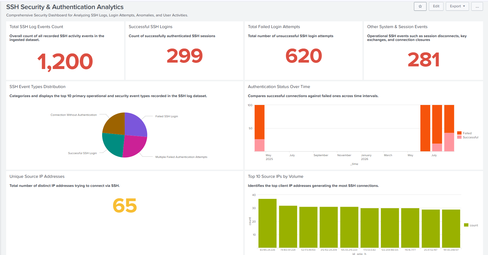
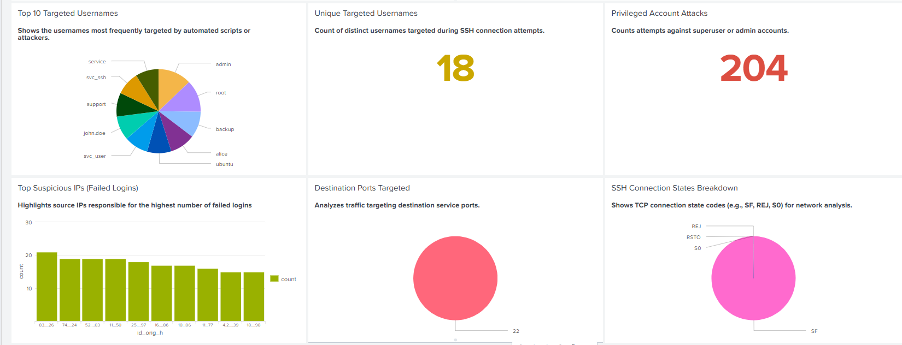
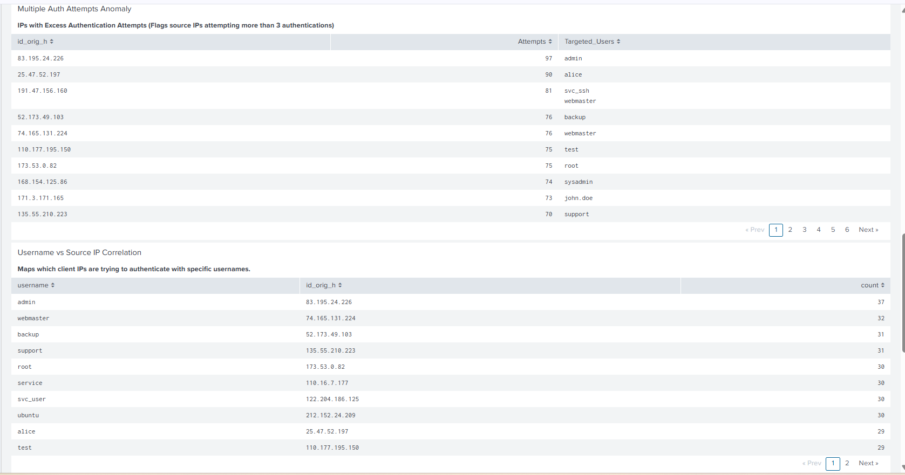
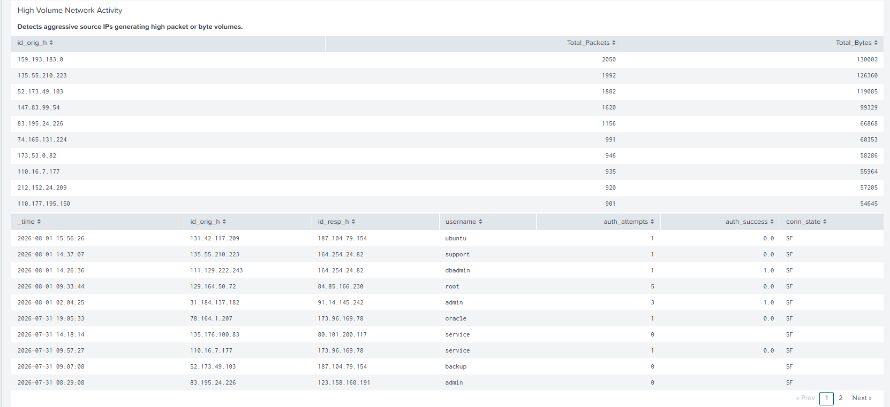

# SSH Security & Authentication Analytics (Splunk SIEM)

## 1. Executive Summary
This enterprise-grade Security Operations Center (SOC) project implements an end-to-end **SSH Security & Authentication Analytics Solution** built inside **Splunk Enterprise**. Secure Shell (SSH) remains one of the most vital remote access protocols in corporate infrastructure; however, its high-privilege nature makes it a primary target for brute-force attacks, password spraying, unauthorized access attempts, and network reconnaissance.

By leveraging Splunk Enterprise, this project ingests structured SSH connection logs (Zeek/Bro format), performs field extraction, visualizes operational and security metrics via an interactive 20-panel dashboard, and establishes **10 automated SIEM alert triggers** linked directly to a standardized **SOC Incident Response Playbook**.

---

## 2. System Architecture & Technical Flow

```
[ Remote SSH Clients / External Attackers ]
                    │
                    ▼  (SSH Connection / Auth Traffic)
[ Target SSH Servers / Network Perimeter ]
                    │
                    ▼  (Zeek/Bro Structured SSH Logs)
[ Splunk Enterprise SIEM Platform ]
    ├── Index: index=ssh_logs
    ├── Field Extraction & Schema Normalization
    │
    ├──► Interactive 20-Panel Security Dashboard
    └──► Automated Detection Engine (10 Production Rules)
          │
          ▼
[ SOC Analyst Incident Response Playbook Workflows ]
```

---

## 3. Dataset Overview & Field Schema

The dataset comprises **1,200 structured SSH event records** adhering to the Zeek/Bro log format, ingested under `index=ssh_logs`.

### Dataset Splitting Strategy (80/20 Rule)
* **80% Baseline Dataset (960 Events):** Ingested initially to establish historical traffic baselines, populate dashboard visualizations, and construct detection logic.
* **20% Testing Dataset (240 Events):** Retained and dynamically ingested during testing phases to simulate live attack scenarios and validate that automated alerts trigger accurately.

### Comprehensive Field Dictionary

| Field Name | Data Type | Sample Value | Description & Security Purpose |
| :--- | :--- | :--- | :--- |
| **`_time`** | Timestamp | `2026-08-06 01:41:00` | Date and time when the SSH connection event was recorded. |
| **`id_orig_h`** | String (IPv4) | `192.168.1.105` | Source / Client IP address initiating the SSH connection. |
| **`id_orig_p`** | Integer | `54210` | Ephemeral source port number on the client system. |
| **`id_resp_h`** | String (IPv4) | `10.0.0.15` | Destination / Server IP receiving the SSH connection. |
| **`id_resp_p`** | Integer | `22` | Destination port on target server (Standard: 22). |
| **`username`** | String | `root`, `admin` | User identity or account name attempted during authentication. |
| **`auth_success`** | Boolean/Num | `true` / `false` (`1.0` / `0.0`) | Authentication result status. |
| **`auth_attempts`** | Integer | `4` | Number of password authentication attempts within a single session. |
| **`event_type`** | String | `Failed SSH Login` | Categorization of event (e.g., Successful Login, Disconnect). |
| **`conn_state`** | String | `SF`, `REJ` | TCP connection state code (`SF` = established/closed, `REJ` = rejected). |
| **`orig_pkts`** | Integer | `850` | Total count of network packets sent by origin client IP. |
| **`orig_ip_bytes`** | Integer | `124050` | Total byte volume transmitted by origin client IP. |

---

## 4. Comprehensive 20-Panel Dashboard Specifications

The interactive Splunk dashboard consists of 20 analytical visualization panels categorized into four distinct operational views.

---

### Panel 01: Total SSH Log Events Count
* **Description**: Displays the overall count of all recorded SSH activity events in the baseline dataset (1,200 events).
* **Visual Type**: Single Value Widget
* **SPL Query**:
```spl
index="ssh_logs" | stats count
```

### Panel 02: Successful SSH Logins
* **Description**: Tracks the total count of successfully authenticated SSH connection sessions.
* **Visual Type**: Single Value Widget
* **SPL Query**:
```spl
index="ssh_logs" (auth_success="true" OR auth_success=1) | stats count
```

### Panel 03: Total Failed Login Attempts
* **Description**: Total count of failed authentication attempts across the environment, highlighting potential brute-force activity.
* **Visual Type**: Single Value Widget
* **SPL Query**:
```spl
index="ssh_logs" (auth_success="false" OR auth_success=0) | stats count
```

### Panel 04: Other System & Session Events
* **Description**: Tracks non-authentication operational events such as key exchanges and session disconnects.
* **Visual Type**: Single Value Widget
* **SPL Query**:
```spl
index="ssh_logs" NOT auth_success=* | stats count
```


*Figure 1: Overall SSH activity summary including total logs, success/failure counts, and event distribution.*

---

### Panel 05: SSH Event Types Distribution
* **Description**: Categorizes primary operational and security event types recorded in the log stream.
* **Visual Type**: Pie Chart
* **SPL Query**:
```spl
index="ssh_logs" | top limit=10 event_type
```

### Panel 06: Authentication Status Over Time
* **Description**: Time-series comparison tracking successful vs. failed logins over time intervals to detect spike anomalies.
* **Visual Type**: Column Chart / Timechart
* **SPL Query**:
```spl
index="ssh_logs" | timechart count by auth_success
```

### Panel 07: Unique Source IP Addresses
* **Description**: Counts total distinct client IP addresses attempting SSH connections.
* **Visual Type**: Single Value Widget
* **SPL Query**:
```spl
index="ssh_logs" | stats dc(id_orig_h) as unique_ips
```

### Panel 08: Top 10 Source IPs by Volume
* **Description**: Identifies the top client IP addresses originating the highest volume of SSH connection requests.
* **Visual Type**: Bar Chart
* **SPL Query**:
```spl
index="ssh_logs" | top limit=10 id_orig_h
```

---

### Panel 09: Top 10 Targeted Usernames
* **Description**: Highlights usernames most frequently targeted by automated password guessing tools.
* **Visual Type**: Pie / Donut Chart
* **SPL Query**:
```spl
index="ssh_logs" | top limit=10 username
```

### Panel 10: Unique Targeted Usernames
* **Description**: Single-value count of distinct account names targeted across all SSH connection attempts.
* **Visual Type**: Single Value Widget
* **SPL Query**:
```spl
index="ssh_logs" | stats dc(username) as unique_users
```

### Panel 11: Privileged Account Attacks
* **Description**: Tracks connection attempts specifically targeting superuser accounts (`root`, `admin`, `sysadmin`).
* **Visual Type**: Single Value Widget
* **SPL Query**:
```spl
index="ssh_logs" (username="root" OR username="admin" OR username="sysadmin") | stats count
```

### Panel 12: Top Suspicious IPs (Failed Logins)
* **Description**: Displays source IPs responsible for the highest number of failed authentication attempts.
* **Visual Type**: Bar Chart
* **SPL Query**:
```spl
index="ssh_logs" (auth_success="false" OR auth_success=0) | top limit=10 id_orig_h
```


*Figure 2: Targeted usernames breakdown, privileged account attacks, and top failed login source IPs.*

---

### Panel 13: Destination Ports Targeted
* **Description**: Analyzes distribution of destination service ports (identifying standard port 22 vs non-standard ports).
* **Visual Type**: Pie Chart
* **SPL Query**:
```spl
index="ssh_logs" | top limit=10 id_resp_p
```

### Panel 14: SSH Connection States Breakdown
* **Description**: Displays TCP state codes (`SF`, `REJ`, `S0`) to evaluate connection establishment health and network blocks.
* **Visual Type**: Pie Chart
* **SPL Query**:
```spl
index="ssh_logs" | top limit=10 conn_state
```

### Panel 15: Multiple Auth Attempts Anomaly
* **Description**: Identifies source IPs attempting more than 3 password credentials within a single connection session.
* **Visual Type**: Data Table
* **SPL Query**:
```spl
index="ssh_logs" auth_attempts>3 | stats sum(auth_attempts) as Attempts, values(username) as Targeted_Users by id_orig_h
```

### Panel 16: Username vs Source IP Correlation
* **Description**: Maps source client IP addresses directly against the specific usernames they attempted to log into.
* **Visual Type**: Data Table
* **SPL Query**:
```spl
index="ssh_logs" | stats count by username, id_orig_h | sort - count
```


*Figure 3: Session authentication attempt anomalies and username-to-source-IP correlation matrices.*

---

### Panel 17: High Volume Network Activity
* **Description**: Detects aggressive source IPs generating high packet counts or large byte transfer volumes.
* **Visual Type**: Data Table
* **SPL Query**:
```spl
index="ssh_logs" | stats sum(orig_pkts) as "Total Packets", sum(orig_ip_bytes) as "Total Bytes" by id_orig_h | sort - "Total Packets"
```

### Panel 18: Detailed Raw SSH Logs Inspection
* **Description**: Forensics table displaying raw event attributes for granular SOC triage.
* **Visual Type**: Data Table
* **SPL Query**:
```spl
index="ssh_logs" | table _time, id_orig_h, id_resp_h, username, auth_attempts, auth_success, conn_state | sort - _time
```

### Panel 19: Geolocation / IP Subnet Distribution
* **Description**: Groups incoming traffic volume by client IP subnets using regular expression extractions.
* **Visual Type**: Data Table
* **SPL Query**:
```spl
index="ssh_logs" | stats count by id_orig_h | rex field=id_orig_h "(?<subnet>\d+\.\d+\.\d+)\." | stats sum(count) by subnet
```

### Panel 20: Authentication Failure Ratio per Host
* **Description**: Calculates the percentage failure ratio per client IP to isolate persistent malicious actors.
* **Visual Type**: Data Table
* **SPL Query**:
```spl
index="ssh_logs" | stats count as Total, count(eval(auth_success="false" OR auth_success=0)) as Failures by id_orig_h | eval Failure_Rate=round((Failures/Total)*100, 2) | sort - Failure_Rate
```


*Figure 4: High volume network activity inspection, raw log table, and failure ratio analytics.*

---

## 5. Automated SIEM Alerts (`savedsearches.conf`)

The framework implements **10 automated SIEM detection rules** configured via Splunk's backend configuration file (`savedsearches.conf`).

```ini
[Alert 01 - SSH Brute-Force Attack Detected]
search = index="ssh_logs" (auth_success="false" OR auth_success=0) | stats count as failed_attempts by id_orig_h | where failed_attempts >= 5
cron_schedule = */5 * * * *
description = Triggers when a single Source IP accumulates 5 or more failed SSH login attempts.

[Alert 02 - Root Account Login Targeting]
search = index="ssh_logs" username="root" | stats count, values(id_orig_h) as source_ips by auth_success
cron_schedule = */5 * * * *
description = Generates an immediate critical alert whenever authentication attempts target the superuser root account.

[Alert 03 - High Authentication Attempts Anomaly]
search = index="ssh_logs" auth_attempts > 3 | stats sum(auth_attempts) as total_attempts by id_orig_h, username
cron_schedule = */5 * * * *
description = Flags connection sessions where a single client attempts more than 3 password credentials.

[Alert 04 - Unusual Nighttime SSH Access]
search = index="ssh_logs" (date_hour >= 0 AND date_hour <= 5) | stats count by id_orig_h, username, auth_success
cron_schedule = 0 6 * * *
description = Detects SSH login attempts occurring during off-peak hours (12:00 AM - 05:00 AM).

[Alert 05 - Potential Password Spraying Attack]
search = index="ssh_logs" | stats dc(username) as distinct_users by id_orig_h | where distinct_users > 3
cron_schedule = */10 * * * *
description = Triggers when a single source IP attempts logins against more than 3 distinct username accounts.

[Alert 06 - SSH Login Success After Failures]
search = index="ssh_logs" | stats count(eval(auth_success="false" OR auth_success=0)) as Failures, count(eval(auth_success="true" OR auth_success=1)) as Successes by id_orig_h, username | where Failures > 2 AND Successes > 0
cron_schedule = */5 * * * *
description = High-severity alert triggering when a source IP successfully authenticates after prior failures.

[Alert 07 - High Packet Count SSH Session]
search = index="ssh_logs" orig_pkts > 800 | stats sum(orig_pkts) as Total_Packets by id_orig_h, username
cron_schedule = */15 * * * *
description = Identifies abnormally heavy network traffic sessions (>800 packets), signaling possible exfiltration or fuzzing.

[Alert 08 - Admin/Service Account Access Attempt]
search = index="ssh_logs" (username="admin" OR username="webmaster" OR username="dbadmin" OR username="backup") | stats count by id_orig_h, username, auth_success
cron_schedule = */5 * * * *
description = Monitors and flags authentication attempts targeting sensitive service accounts.

[Alert 09 - Non-Authenticated SSH Connection Anomaly]
search = index="ssh_logs" conn_state!="SF" OR event_type="Connection Without Authentication" | stats count by id_orig_h, conn_state
cron_schedule = */15 * * * *
description = Detects network connection sessions that terminate or drop before entering authentication phases.

[Alert 10 - Distributed SSH Connection Activity]
search = index="ssh_logs" | stats dc(id_orig_h) as unique_attackers by id_resp_h | where unique_attackers >= 10
cron_schedule = */10 * * * *
description = Flags target server IPs receiving connection attempts from more than 10 unique source IP addresses.
```

---

## 6. SOC Incident Response Playbook

When an automated alert fires, SOC analysts follow this standardized Incident Response Playbook workflow:

```
                  ┌─────────────────────────────────┐
                  │     SIEM ALERT TRIGGERED        │
                  └────────────────┬────────────────┘
                                   │
                                   ▼
                  ┌─────────────────────────────────┐
                  │    STEP 1: INITIAL TRIAGE       │
                  │ - Verify Source IP & Timestamp  │
                  │ - Identify Targeted Account     │
                  │ - Check Auth Outcome Status     │
                  └────────────────┬────────────────┘
                                   │
                                   ▼
                  ┌─────────────────────────────────┐
                  │  STEP 2: INVESTIGATION & SCOPE  │
                  │ - Correlate IP in Panel 16      │
                  │ - Check Panel 17 Packet Volume  │
                  │ - Review Threat Intel Feeds     │
                  └────────────────┬────────────────┘
                                   │
         ┌─────────────────────────┴─────────────────────────┐
         │                                                   │
         ▼ (True Positive)                                   ▼ (False Positive)
┌─────────────────────────────────┐                 ┌─────────────────────────────────┐
│  STEP 3A: CONTAINMENT & BLOCK   │                 │  STEP 3B: TUNING & CLOSE        │
│ - Block IP at Perimeter Firewall│                 │ - Adjust SPL Threshold          │
│ - Isolate Compromised System    │                 │ - Document FP in SOC Ticket     │
│ - Force Password Reset / Revoke │                 │ - Close Alert Ticket            │
└─────────────────────────────────┘                 └─────────────────────────────────┘
```

### Actionable Triage Steps by Alert

1. **Brute-Force & Password Spraying (Alerts 01, 05):** Immediately block `id_orig_h` at the perimeter firewall. Force password resets for all targeted accounts if logins succeeded.
2. **Root & Service Account Probing (Alerts 02, 08):** Verify authorization. If unauthorized, isolate target host immediately and escalate to Tier-3 IR/CISO.
3. **Login Success After Failures (Alert 06):** Assume account compromise. Terminate active sessions immediately, revoke user credentials, and perform host forensics.
4. **Network Volume & Dropped Sessions (Alerts 07, 09):** Inspect packet captures for data exfiltration and apply network rate-limiting.

---

## 7. Installation & Deployment Guide

### Step 1: Ingest Log Dataset
1. Log into Splunk Web UI -> **Settings** -> **Add Data**.
2. Upload the baseline SSH dataset (`960 events`).
3. Set Source Type to `zeek:ssh` or custom JSON, and specify index as `ssh_logs`.

### Step 2: Deploy Dashboard XML
1. Navigate to **Dashboards** -> **Create New Dashboard**.
2. Title: `SSH Security & Authentication Analytics`.
3. Switch view to **Source Code** and paste the dashboard XML configuration.
4. Save and verify that panels render with `index=ssh_logs`.

### Step 3: Configure SIEM Alerts (`savedsearches.conf`)
1. Place the 10 alert stanzas into `$SPLUNK_HOME/etc/apps/search/local/savedsearches.conf`.
2. Restart Splunk via UI or CLI (`splunk restart`).
3. Verify rules under **Settings** -> **Searches, Reports, and Alerts**.

### Step 4: Live Attack Simulation (20% Test Dataset)
1. Upload the remaining 240 test log events into `index=ssh_logs`.
2. Confirm that alerts trigger under **Activity > Triggered Alerts** to validate real-time threat detection capabilities.
